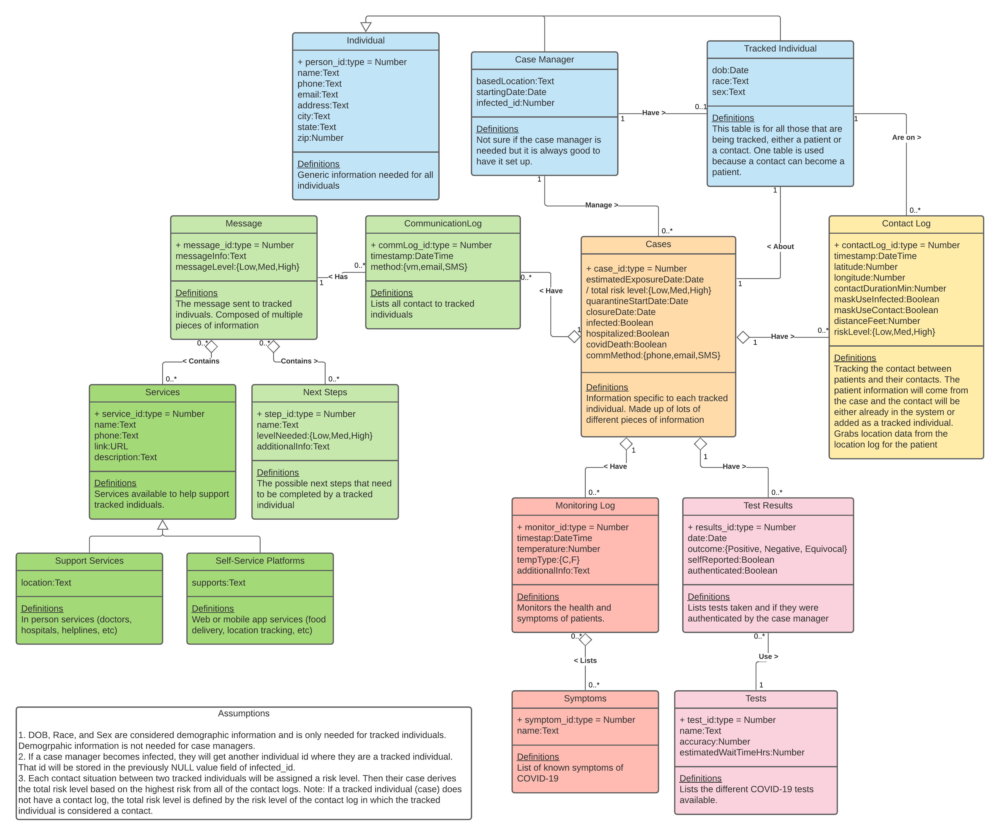
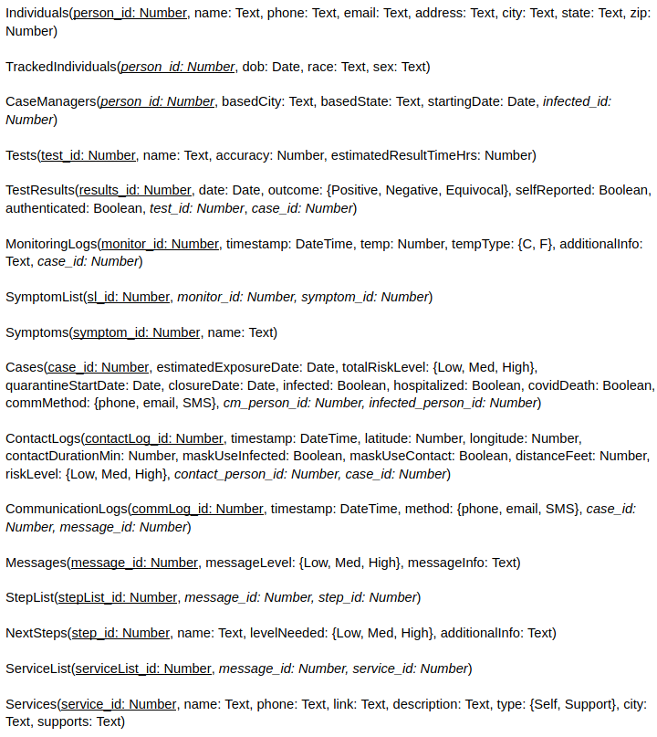

## Conceptual Model: UML

[Click here  to view the conceptual model in Lucid Chart.](https://app.lucidchart.com/invitations/accept/5602312e-dfc3-4423-975c-47190ce6022e)

<!-- Ensure this is the most up to date image -->
\

## Logical Model: ERD

[Click here  to view the logical model in Lucid Chart.](https://app.lucidchart.com/invitations/accept/7b497cbf-268d-4a03-b1a7-822b5a844fea)

<!-- Ensure this is the most up to date image -->
\

## Schema

[Click here  to view the schema in Google Docs.](https://docs.google.com/document/d/1o8pk51aed3BJSaBcwO2EMbT8I3ru_wpGTcTN4W-DbIM/edit?usp=sharing)

<!-- Ensure this is the most up to date image -->
\

## Creating Database Tables

## Populating The Database

## Queries