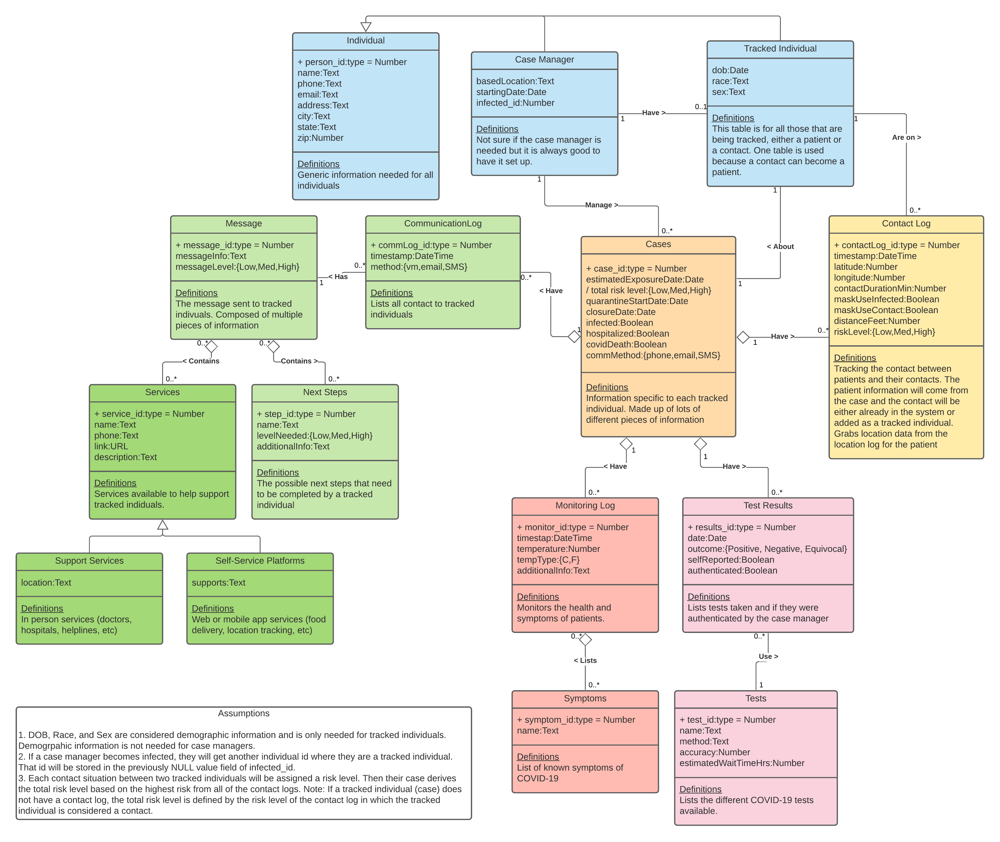
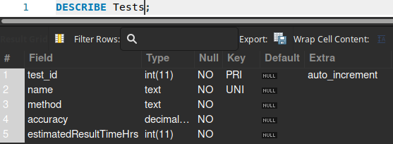

The steps we completed for Practicum 1 are detailed below. Please note that there are links to each image that requires it in each section. We decided to focus our attention on the case management aspect of the contract tracing problem.

## Conceptual Model: UML

View the conceptual model in Lucid Chart here:

https://app.lucidchart.com/invitations/accept/5602312e-dfc3-4423-975c-47190ce6022e

<!-- Ensure this is the most up to date image -->
\

## Logical Model: ERD

View the logical model in Lucid Chart here:

https://app.lucidchart.com/invitations/accept/7b497cbf-268d-4a03-b1a7-822b5a844fea

<!-- Ensure this is the most up to date image -->
\

## Schema

View the schema in Google Docs here:

https://docs.google.com/document/d/1o8pk51aed3BJSaBcwO2EMbT8I3ru_wpGTcTN4W-DbIM/edit?usp=sharing

<!-- Ensure this is the most up to date image -->
\

## Creating Database Tables

Should you wish to inspect the scripts that create the database and populate data, they can be found at:

https://github.com/eldss-classwork/databases-practicum1-scripts

The following images will show a progression from an empty database through table creation in MySQL Workbench.

The MySQL Workbench start screen.

\

The newly created, empty `test` database.

\

The `test` database after table creation.

\

The following photos provide a detailed look at the schema of each table as it was created in MySQL.

\
\
\
\
\
\
\
\
\
\
\
\
\
\
\
\
\
\
\

## Populating The Database

## Queries